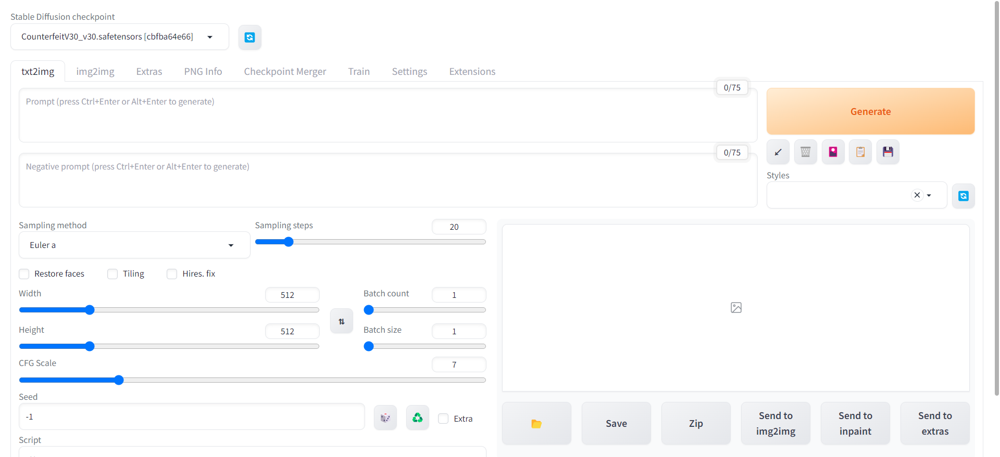

:::info
stable diffusion 是一种潜在的文本到图像扩散模型，能够在输入任何文本的情况下生成图像, 也可以由图片生成图片
:::

### 准备环境
- 
- 

`pytorch` 可以提前下载 `whl` 包安装，比直接 `pip install` 快。
[pytorch whl下载地址](https://download.pytorch.org/whl/torch_stable.html)

执行 `pip install + wheel文件名`
```shell
# 举例
pip install torch-2.0.0-cu118-cp310-cp310-win_amd64.whl
```
启动时，会把所有所有依赖都存在 `stable-diffusion-webui/venv` 目录下


### 代码下载
- 仓库地址： [https://github.com/AUTOMATIC1111/stable-diffusion-webui](https://github.com/AUTOMATIC1111/stable-diffusion-webui)
，基于 webui 封装后的 sd 更加便于使用，所以下载 webui 版本的代码。
```shell
git clone https://github.com/AUTOMATIC1111/stable-diffusion-webui.git
```

### 模型下载
以下有几个常用的知名模型下载网站，如果有需要的可以先去下载自己喜欢的模型再来启动 stable diffusion
这样可以避免等待模型下载时间过长, 也可以之后再来下载需要的模型
- [hugging face](https://huggingface.co/)
- [civitai](https://civitai.com/)


### 运行 stable diffusion
进入代码文件夹 `stable-diffusion-webui`
- Windows 双击 `webui-user.bat` 运行
- Linux / MacOs 执行 `webui-user.sh` 运行

**初始启动会下载默认的SD模型，模型会比较大(4G), 如果有需要的模型，也可以提前下载，放入 `stable diffusion/models` 目录**

启动后日志不报错即可，可以在日志中看到访问URL [http://127.0.0.1:7860](http://127.0.0.1:7860)

打开链接后可以看到基于 [gradio](https://gradio.app/) 部署的AI算法可视化界面

